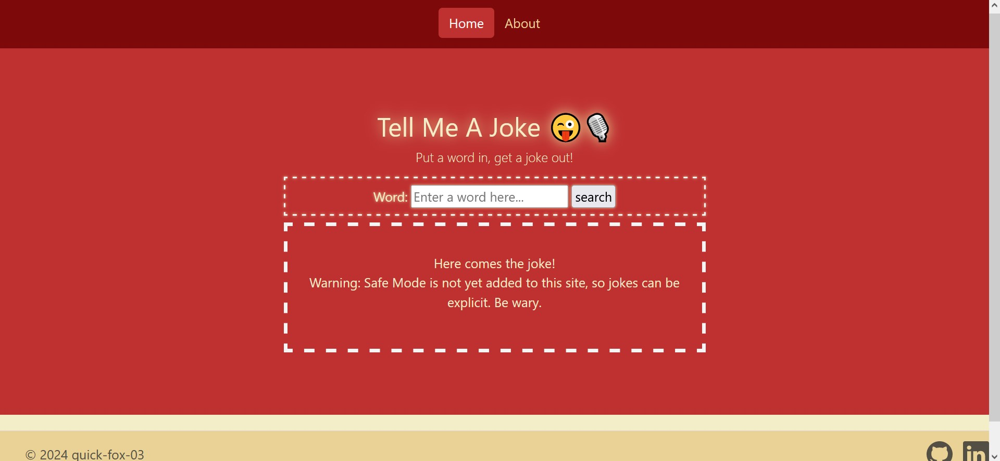
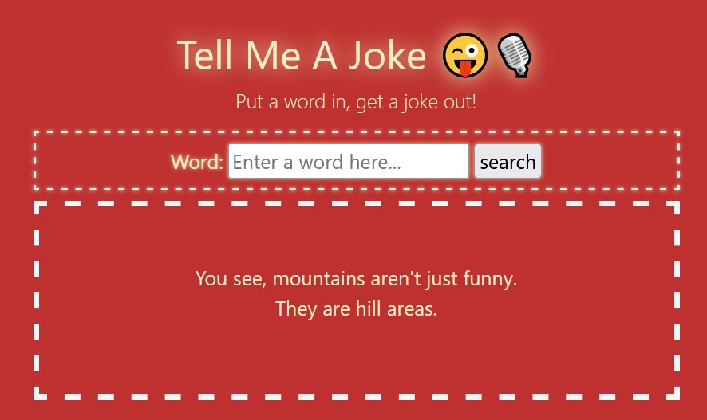

# Tell-Me-A-Joke
This is a small website that tells users joke using JokeAPI.

Since this site doesn't have a hosting server, it can be run locally using NodeJS. 
# Installation
* Make sure you have NodeJS installed using <code>npm --version</code> on your CLI. If not, you may install it from the nodeJS website.
* Use <code>npm i</code> in your terminal to install all dependencies before running the website. 
* Run the node application using <code>node index.js</code> in the terminal, once you have navigated to root directory in parent folder.
* Go to the localhost port address provided in the console, and have fun! By default, the localhost port address is set to <code>localhost:3000</code>
# How to run
The website is easy to use. Simply put a word in the search box, and the application will return a joke using that word.

Visit the about page to get information on the API and a link to the JokeAPI Website.

# Screenshots

Home Page

Joke Example

